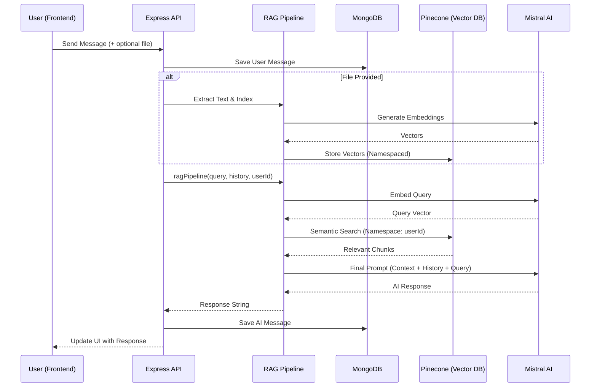

# 🚀 Perplexity AI - Full-Stack RAG Chat Application

This project is a high-performance **Full-Stack AI Chat Application** built using the **MERN** stack, augmented with **Retrieval-Augmented Generation (RAG)**. It allows users to have intelligent conversations with an AI that can "remember" uploaded documents and search through them using semantic vector search.

---

## 1. 🧠 Project Overview

*   **App Purpose**: A private, document-aware AI assistant.
*   **Key Features**:
    *   **Real-time Chat**: Interactive conversation with history.
    *   **File Upload & Indexing**: Support for PDF, Images, and Text files.
    *   **Semantic RAG Search**: Uses vector embeddings to find relevant facts from your own data.
*   **Why RAG?**: LLMs have a knowledge cutoff and limited context windows. RAG provides the model with specific, up-to-date information from the user's own documents without needing to re-train the model.

---

## 2. 🔄 FULL SYSTEM FLOW

The diagram below shows how a message travels from the browser to the AI and back, incorporating the RAG pipeline.



> ℹ️ **Same-request retrieval**: If a user uploads a file and sends a query in the same request, indexing finishes before `ragPipeline()` runs. That means newly uploaded documents are indexed and become searchable within the same request cycle.

---

## 3. 🎨 FRONTEND ARCHITECTURE

The frontend is a modern React application focused on a seamless chat experience.

*   **Structure**:
    - `src/features/chat`: Contains UI components like `MessageList`, `ChatInput`, and `Sidebar`.
    - `src/features/chat/services`: Contains `chat.api.js` for all backend communication.
*   **API Integration**: Uses `axios` with `withCredentials: true` for secure, cookie-based sessions.
*   **File Upload**: Uses `FormData` to send binary files (PDF/Images) to the backend via `multipart/form-data`. When a file is included, the request is encoded as `multipart/form-data`; otherwise it is sent as plain `application/json`.
*   **State Management**: Locally managed chat state that updates optimistically when messages are sent.

> ℹ️ **File + Query in one request**: A user can attach a file and type a query simultaneously. The backend processes these atomically: the file is indexed **first**, and the resulting vectors are **immediately** searchable within the same pipeline execution. There is no delay or second request needed.

---

## 4. ⚙️ BACKEND ARCHITECTURE

A modular Node.js/Express server following the **Controller-Service-Model** pattern.

*   **Controllers (`/controller`)**: Thin HTTP adapters that receive the request and format the final JSON response.
*   **Services (`/services`)**: Contain core business logic (RAG, AI interactions, file processing). In this app, `processChatMessage()` is the main orchestration layer, while `services/rag/*` contains the indexing, retrieval, and prompt-building steps.
*   **Models (`/models`)**: Mongoose schemas for `User`, `Chat`, `Message`, and `File`.
*   **Routes (`/routes`)**: Define the API surface (e.g., `/api/chats/message`) and attach middleware such as auth, upload parsing, and validation before the controller runs.

> ℹ️ **Controller vs middleware vs service**: The route and middleware layer handles concerns like `multipart/form-data`, auth, and validation. The controller stays thin and delegates to the service layer, where the full chat + upload + RAG workflow actually runs.

---

## 5. 🧠 RAG SYSTEM (CORE)

The RAG system is split into two distinct workflows: **Indexing** and **Retrieval**. In practice, a single request can run both back-to-back. If a user uploads a file and asks a question in the same call, the upload is processed first and the newly stored chunks can be retrieved immediately.

### 🔹 Indexing Flow (Storing Knowledge)
1.  **Extraction**: `extractTextFromFile()` pulls text from PDFs, text files, or uses ImageKit output for image-based uploads.
2.  **Chunking**: `chunker()` from `utils/chunker.js` splits long documents into smaller, overlapping segments. The current implementation uses `chunkSize: 500` and `chunkOverlap: 50`, which balances retrieval precision with context continuity.
3.  **Embedding**: The `mistral-embed` model converts text chunks into 1024-dimension numerical vectors.
4.  **Storage**: `embedAndStoreDocuments()` stores vectors in **Pinecone** under a specific `namespace` (the user's ID), using records shaped like `{ id, values, metadata: { text } }`.

> ℹ️ **Same-request indexing behavior**: `processChatMessage()` completes extraction, duplicate detection, and indexing before it calls `ragPipeline()`. So when a file and query arrive together, the file is searchable immediately in that same request cycle.

### 🔹 Retrieval Flow (Finding Knowledge)
1.  **Query Embedding**: The user's question is converted into a 1024-dimension vector using the same `mistral-embed` model used at indexing time. Using the same model on both sides guarantees vector space compatibility, meaning the query and the stored chunks live in the same mathematical space.
2.  **Vector Search**: Pinecone searches for the **top-5 most similar chunks** (`topK: 5`) within the user's namespace and returns metadata with each match.
    *   **Why topK = 5?** This limit is intentional. More results can improve recall, but they also increase prompt size, token cost, and the chance of feeding weakly related chunks into the model. `topK: 5` is a practical balance between answer coverage and response quality.
    *   Raising `topK` can improve recall for broad questions, but it risks introducing noise and near-duplicate chunks. Lowering it reduces noise and token usage, but may miss supporting evidence needed for multi-part answers.
3.  **Context Assembly**: The `text` field from each match's `metadata` is extracted and joined with `\n---\n` separators into a single readable block. The similarity score is not used in the prompt, only the raw text. This is why `metadata.text` matters: Pinecone can tell us *which* chunks are similar, but the LLM still needs the original text content to answer the question.
4.  **Fallback**: If Pinecone returns no matches, the retrieved context is an empty string. If no relevant context is found in the vector database, the system falls back to the LLM's general knowledge. The same fallback also protects the chat flow when retrieval fails due to a service error.

### 🔹 Pipeline Flow (The Brain)
The `ragPipeline` orchestrates the final AI response using a clear **priority hierarchy**:

| Priority | Source | When Used |
| :--- | :--- | :--- |
| 1st | Uploaded file request | When the current request included a file, the backend extracts text, checks for duplicates, and indexes new chunks before retrieval starts |
| 2nd | Pinecone retrieved context | When relevant chunks are found in the user's namespace, including chunks inserted earlier in the same request |
| 3rd | LLM general knowledge | Fallback when no vector context is available or retrieval fails |

Operationally, the decision process is:
1.  If a file is attached, process and index it first.
2.  Query Pinecone for relevant chunk text.
3.  If retrieved context exists, inject it into the prompt.
4.  Otherwise, let the LLM answer from its built-in knowledge.

One important implementation detail: the current request does **not** inject the full extracted file body directly into the prompt. Instead, the service adds a lightweight file marker and relies on Pinecone retrieval to load the actual searchable chunk text. That keeps prompt size small while still allowing newly uploaded files to be used immediately.

The system prompt is built **dynamically**: sections are only added if they contain content.

```txt
You are an intelligent knowledge assistant.

## Uploaded Document Content:
[File: uploaded-document-name.ext]

## Knowledge Base Facts:
[Pinecone chunks — only present if results were found]

Rules:
- If the document above contains the answer, use it.
- If the Knowledge Base contains the answer, use it.
- Otherwise, fallback to your general intelligence.
```

*   The last **10 messages** of chat history are appended (with `"ai"` role remapped to `"assistant"` to satisfy the Mistral API message format) before the final user query.
*   If Pinecone returns no matches, the Knowledge Base section is simply omitted and the model answers using general knowledge.
*   If the **entire RAG pipeline throws an error** (for example, a Pinecone network failure), a top-level `try/catch` makes a direct, context-free call to Mistral. The user still gets a response and the chat never breaks.

---

## 6. 🔐 MULTI-USER ISOLATION

Security is built into the data layer:
*   **MongoDB**: Every `Chat` and `File` record is linked to a `user` ID.
*   **Pinecone Namespaces**: We use `userId.toString()` as the namespace in Pinecone. This ensures that even if two users upload the same document, their search results never mix. One user can NEVER retrieve another user's document data.

---

## 7. 📂 FILE HANDLING SYSTEM

*   **Processing**: Uses `multer` (memory storage) to handle uploads. Files **never touch the disk**: they live in memory as a `Buffer`, passed directly to extraction and hashing utilities, eliminating I/O latency and cleanup complexity.
*   **Hashing**: Generates a **SHA-256 hash** of the raw file buffer using Node's built-in `crypto` module:
    ```js
    crypto.createHash("sha256").update(buffer).digest("hex");
    ```
*   **Duplicate Detection**: Before indexing, the backend queries MongoDB for a `File` record matching the same `fileHash` **and** same `userId`. If found, embedding is skipped, saving Mistral API credits and Pinecone write units. If not found, the file is indexed and a new `File` record is created with `isEmbedded: true`.
*   **Upload + Query Interaction**: When a file and a question arrive together, the file path through extraction, hashing, duplicate detection, and indexing completes before the query enters `ragPipeline()`. That sequencing is what makes same-request searchability possible.
*   **Prompt Strategy**: The backend does not dump the entire uploaded file into the prompt. It stores chunk text in Pinecone and then retrieves only the most relevant `metadata.text` snippets for the active question. This keeps prompts smaller and scales better for large documents.
*   **Supported Formats**:

    | MIME Type | Extraction Method |
    | :--- | :--- |
    | `application/pdf` | Parsed with `pdf-parse` |
    | `image/*` | Uploaded to ImageKit for OCR/tag extraction |
    | `text/plain` | Buffer decoded directly to UTF-8 string |

> ℹ️ **Same-request searchability**: Newly uploaded documents are indexed and become searchable **within the same request cycle**. The indexing step completes before `ragPipeline()` is called, so a user asking a question about a file they just uploaded gets a contextually aware answer immediately with no second request needed.

---

## 8. 💬 CHAT SYSTEM FLOW

1.  **Message Creation**: Every message is saved to MongoDB immediately with a `role` of `"user"` or `"ai"`. Before being passed to the Mistral API, `"ai"` is remapped to `"assistant"`, which matches the message format expected by the chat model.
2.  **History Retrieval**: All messages for the active chat are fetched via `.find({ chat: activeChatId }).sort({ createdAt: 1 })`. The **current user message is excluded** from history (it is sliced off the end) and only the last **10 prior messages** are forwarded to the RAG pipeline. This keeps token usage bounded regardless of how long a conversation grows.
3.  **Title Generation**: When a new chat is created (`chatId` is absent or starts with `"temp_"`), the backend calls `messageTitleGenerator(message)` with the user's first message to generate a short, descriptive title. This title is stored in the `Chat` document and displayed in the sidebar.
4.  **New Chat Detection**: A `chatId` beginning with `"temp_"` is treated identically to no `chatId`: a new MongoDB `Chat` document is created and its real `_id` is returned to the frontend, which replaces the optimistic temp ID.
5.  **Empty History**: If history is an empty array (brand-new chat), the pipeline handles this gracefully. `chatHistory.slice(-10)` returns `[]`, and the LLM receives only the system prompt and the current user query. No special case is required.

---

## 9. 🔗 FRONTEND ↔ BACKEND CONNECTION

| Endpoint | Method | Purpose | Payload |
| :--- | :--- | :--- | :--- |
| `/api/chats/message` | POST | Send a message | `{ message, chatId, file? }` |
| `/api/chats/:chatId` | GET | Load a conversation | N/A |
| `/api/chats/` | GET | List all user chats | N/A |
| `/api/chats/delete` | DELETE | Remove a chat | `{ chatId }` |

---

## 10. ⚙️ KEY FUNCTIONS BREAKDOWN

| Function | File | Role |
| :--- | :--- | :--- |
| `sendMessageController()` | `controller/chat.controller.js` | HTTP entry point that receives the request, delegates to `processChatMessage()`, and formats the response. Intentionally thin. |
| `processChatMessage()` | `services/chat.service.js` | **Shared orchestrator** for both HTTP and Socket.IO. Handles chat creation, file indexing, history retrieval, and RAG invocation in one place. |
| `extractTextFromFile()` | `utils/extractText.js` | Reads the uploaded file buffer and converts it into plain text before hashing and indexing. |
| `chunker()` | `utils/chunker.js` | Splits extracted text into overlapping chunks before embedding so retrieval works at chunk-level granularity instead of whole-document granularity. |
| `indexDocument()` | `services/rag/indexer.service.js` | Entry point for the indexing flow. Chunks the document text and delegates to `embedAndStoreDocuments()`. |
| `embedAndStoreDocuments()` | `services/rag/embedder.service.js` | Batch-embeds all chunks in one API call, formats them as Pinecone records, and upserts them under the user's namespace. |
| `embedQuery()` | `services/rag/embedder.service.js` | Single-query embedding used at retrieval time. Uses the same `mistral-embed` model as indexing to guarantee vector space compatibility. |
| `retrieveDocuments()` | `services/rag/retriever.service.js` | Embeds the query, queries Pinecone with `topK: 5`, and assembles matched chunks into a context string. Returns `""` on failure. |
| `ragPipeline()` | `services/rag/pipeline.service.js` | Builds the dynamic system prompt from retrieved context + history, then calls the LLM. Includes a top-level error fallback. |
| `chatWithMistralAiModel()` | `services/ai.service.js` | Final LLM call used by `ragPipeline()`, and also used by the last-resort fallback path if the RAG pipeline fails completely. |

> ℹ️ **Controller vs Service separation**: The controller handles only the transport layer (HTTP status codes, request parsing, response shape). All business logic lives in `processChatMessage()`. This is intentional because Socket.IO can call `processChatMessage()` directly, reusing the exact same workflow without duplicating code. This is a standard production-grade pattern.
>
> **Call chain clarity**: `sendMessageController()` -> `processChatMessage()` -> `extractTextFromFile()` -> `indexDocument()` -> `ragPipeline()` -> `retrieveDocuments()` -> `chatWithMistralAiModel()`

---

## 11. 🚨 IMPORTANT DESIGN DECISIONS

*   **Why Pinecone?**: MongoDB is great for transactional document storage, but poor at semantic similarity search over dense vectors. Pinecone lets the system retrieve conceptually related chunks even when the user's wording does not exactly match the source document.
*   **Why Pinecone for vector search specifically?**: MongoDB excels at document storage but has no native Approximate Nearest Neighbour (ANN) search in this architecture. Pinecone uses **HNSW indexing** to find semantically similar vectors in milliseconds, which is difficult to replicate efficiently with a standard document database.
*   **Why embeddings are not stored in MongoDB**: A 1024-dimension float vector for even a modest 100-chunk document is substantial. Querying it in MongoDB would require either a full `O(n)` sequential scan or a specialized vector setup. Pinecone handles ANN search natively, at scale.
*   **Why overlapping chunks?**: Meaning often spans multiple sentences. Splitting at hard boundaries can place a key answer across two chunks, causing neither to rank highly in vector search. Overlapping ensures boundary content appears fully within at least one chunk.
*   **Why only store `metadata.text` in Pinecone (not full objects)?**: Pinecone is a vector store, not a document store. Metadata fields are lightweight supplementary data. Storing the raw text chunk is enough to reconstruct context, while relational data such as user info, file references, and upload state lives in MongoDB where querying is efficient.

### 📦 Pinecone Vector Record Format

Each embedded chunk is upserted to Pinecone with this structure:

```js
{
  id: "chunk-<userId>-<timestamp>-<chunkIndex>",
  values: [0.012, -0.847, 0.334, ...],
  metadata: {
    text: "original chunk text goes here"
  }
}
```

*   `id` is derived from `userId` + `Date.now()` + chunk index, guaranteeing uniqueness even under concurrent uploads from multiple users.
*   `values` is the raw embedding Pinecone uses for similarity scoring during search.
*   `metadata.text` is the field the system reads back and injects into the prompt. Without it, Pinecone could return a match ID, but the LLM would not know what the matched chunk actually says.
*   Only the chunk text is stored because that is the only data the retriever needs to build context for the LLM. Storing larger JSON objects would increase vector-store payload size without improving answer quality.

---

## 12. 🧩 EDGE CASES HANDLING

*   **No context found**: If Pinecone returns no matches, `retrieveDocuments()` returns an empty string and the pipeline falls back to the LLM's general knowledge instead of failing the request.
*   **Duplicate file upload**: Duplicate detection is handled with a SHA-256 file hash plus a unique `(user, fileHash)` MongoDB index. If the same user uploads the same file again, embedding is skipped and the system reuses the previously indexed data.
*   **Large file upload**: Large extracted documents are chunked before embedding. This avoids sending one oversized block to the embedding model and improves retrieval precision because the system searches smaller semantic units instead of an entire document blob.
*   **Multi-user isolation**: Pinecone queries are scoped to `namespace = userId.toString()`, and MongoDB records are also user-linked. This prevents cross-user retrieval even when many users share the same physical index.
*   **Empty chat history**: The system still works when history is empty. `chatHistory.slice(-10)` safely returns `[]`, so the final LLM call contains only the system prompt and the current user query.
*   **Retriever or pipeline failure**: Retrieval errors degrade to empty context, and full pipeline errors degrade to a direct LLM call. The chat stays available even when the RAG path is partially unavailable.

---

## 13. ⚡ PERFORMANCE CONSIDERATIONS

*   **Limiting chat history**: Only the last **10** messages are forwarded to the model. This bounds token growth, keeps latency predictable, and avoids paying to resend very old context on every turn.
*   **Chunk size impact**: The current `500 / 50` chunking strategy is a trade-off. Smaller chunks improve retrieval precision but create more vectors. Larger chunks reduce vector count but can blur topics together and reduce answer precision.
*   **Embedding cost optimization**: Duplicate uploads are skipped using file hashing, which avoids repeated calls to the embedding API and unnecessary Pinecone writes.
*   **Vector search efficiency**: Retrieval is limited to the authenticated user's namespace and capped at `topK: 5`. That keeps search focused, reduces noisy matches, and prevents overloading the prompt with low-value context.
*   **Prompt-size control**: The retriever injects only the matched `metadata.text` snippets rather than full files or large metadata objects. That improves response speed and keeps token usage under control.
*   **Batch embedding**: `embedAndStoreDocuments()` embeds all chunks in one batch call, which is more efficient than embedding each chunk one-by-one.

---

## 14. 📈 FUTURE IMPROVEMENTS

1.  **Streaming**: Implement Server-Sent Events (SSE) or WebSockets to show AI responses word-by-word.
2.  **Hybrid Search**: Combine keyword search (BM25) with vector search for better accuracy.
3.  **Re-ranking**: Use a cross-encoder to re-rank the top Pinecone results before sending to the LLM.
4.  **UI Enhancements**: Add markdown rendering (code highlighting, tables) in the chat bubbles.
5.  **Caching**: Use Redis to cache embeddings for frequently asked questions.

---

**Generated by Antigravity AI**
